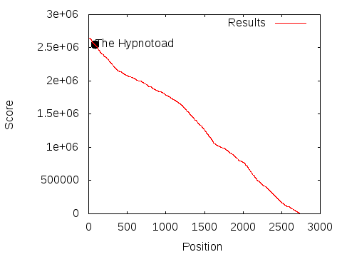

# google-hash-code-2017

The hynotoad team's solutions for the 
[2017 Google Hash Code](https://hashcode.withgoogle.com/)

Team members:

* Gida Pataki ([@gidapataki](https://github.com/gidapataki))
* Mátyás Végh ([@matthiasvegh](https://github.com/matthiasvegh))
* Schaum Béla ([@schaumb](https://github.com/schaumb))
* András Kucsma ([@r0mai](https://github.com/r0mai))

The team reached 80th place, with 2547523 points.

the hypnotoad :clap: :clap: :clap: :clap:

